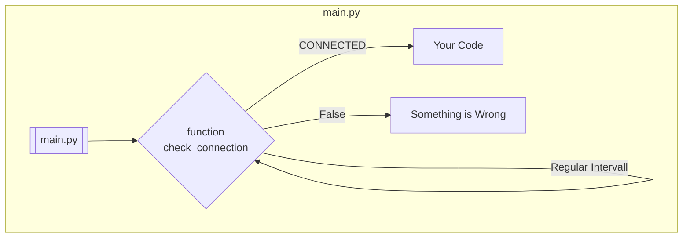
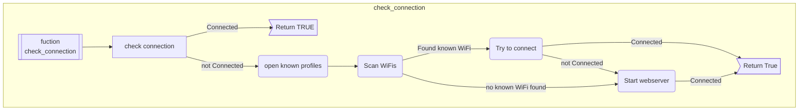
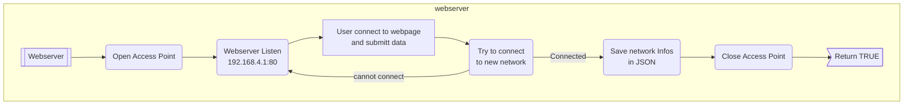
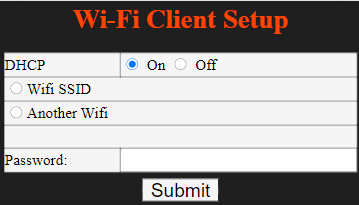
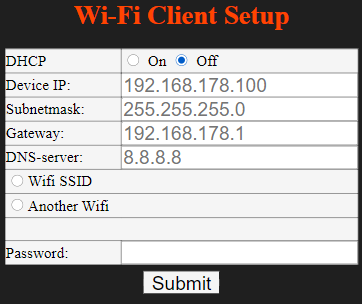
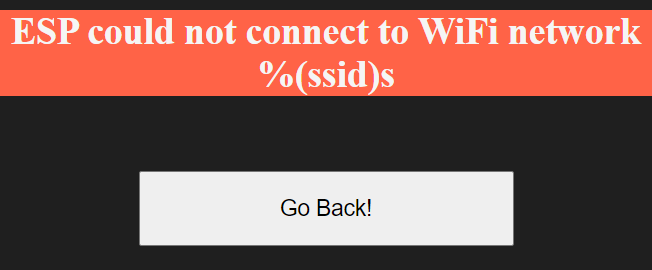

# WifiManager
 
## Version: 1.2.1

<b>Written in  :</b>   MicroPython

<b>Tested on   :</b>   ESP32

<b>Description : </b> WiFi Manager to find, connect and save wifi credentials

<b>Main features :</b>

- Web based connection manager
- save known Networks, IP settings and passwords in "profiles.json" (JSON-Format)
- Easy to include in your projects
- Adapts to many cases

<b>Planned features:</b>
  
- [X] Update website design
- [X] Network IP setup
    - [X] add IP config into HTML webpage
    - [X] merge new form data into ESP programm
    - [X] DHCP 
    - [X] Static IP configuration
    - [X] save ip setup into profiles.json

- [ ] Captive portal for AP
- [ ] Manage (delete) saved Networks
- [ ] More to come

<b>Usage :</b>

1. copy the wifiManager.py in your project folder
2. import the wifiManager in your boot.py (_recommended_) or main.py 
   
    ```python
    import wifiManager
    ```
3. Run the `getConnection()` method

    ```python
    wlan = wifiManager.getConnection()

    if wlan is None:
        print("[WifiMgr] Could not initialize the network connection.")
        while True:
            pass  # you shall not pass :D
    ```
    The `getMethod()` method will return a working `WLAN(STA_IF)` interface or `None`

4. Run your main code afterwards

<b>Logic: </b>

<b>Diagramm:</b>





1. step: check if "profiles.json" contains any reachable networks
2. step: open a web server to configure a new wifi
3. step: save the ssid / password from the configuration to "profiles.json"
4. After successful connection the `wifiAP` gets closed. 
   
    The connection sould be checked in regular intervals to prevent unwanted behaviour!  

5. step: run user code

<b>How to setup wifi configuration:</b>

1. Connect to the AP opened by the ESP
    
    
    
    - default SSID: `PA0DEV-ESP`
    - default pass: `12345678`
2. Open the page `192.168.4.1`
3. With dynamic IP-settings:

    

    - Leave the DHCP on "ON"
    - Select your network and enter the password
    - hit the "Submit" button
4. With static IP-settings:

    

    - Select DHCP to be "Off"
    - Enter the IP-configuration you want to use
    - Select your network and enter the password
    - hit the "Submit" button
5. If you entered everything correctly you will get a message "ESP successfully connected to WiFi network [ YOUR_SSID ]."

    
   
   If not, you will get "ESP could not connect to WiFi network [ YOUR_SSID ]

   


snippets of the code are inpired by https://github.com/tayfunulu/WiFiManager

